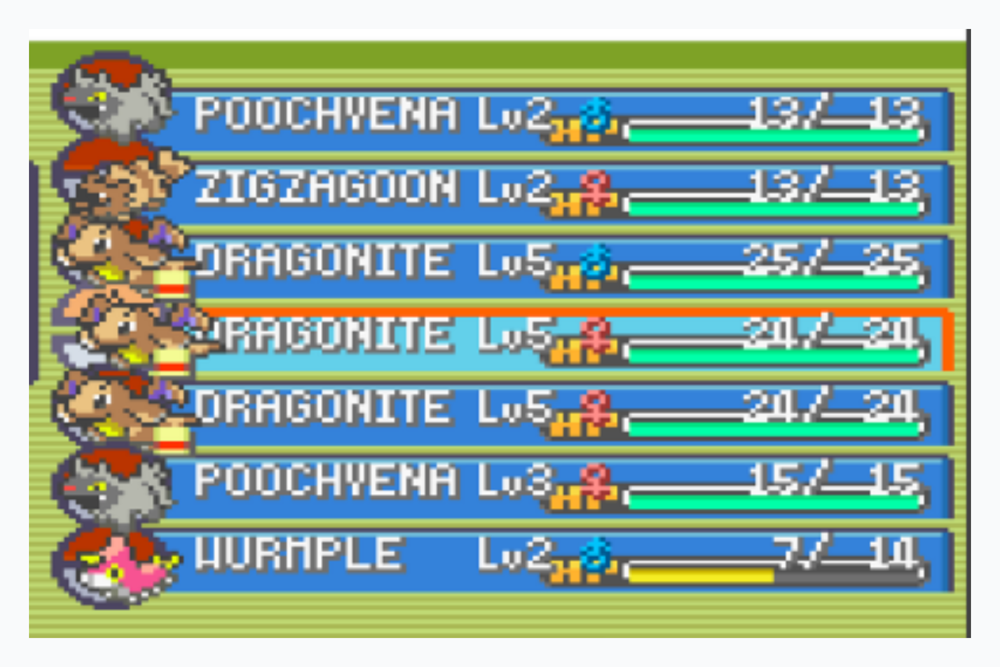

Desafio surpresa:

### O QUE PRECISA SER FEITO ?

Crie um código para armazenar o máximo de informações possível dos pokemon da imagem ao lado e ao final, para cada um, exiba uma mensagem de saída escrita o nome do pokemon concatenado com "Cadastrado com sucesso".

EXEMPLO:
"DRAGONITE Cadastrado com sucesso"

REGRAS:

> Você pode utilizar Javascript ou qualquer outra linguagem da sua preferência
Você pode utilizar o playcode.io ou qualquer outra ide da sua preferência
Ao final deve submeter o código aqui na plataforma da dio clicando em "entregar projeto"
>